# Photos
For your viewing convenience:

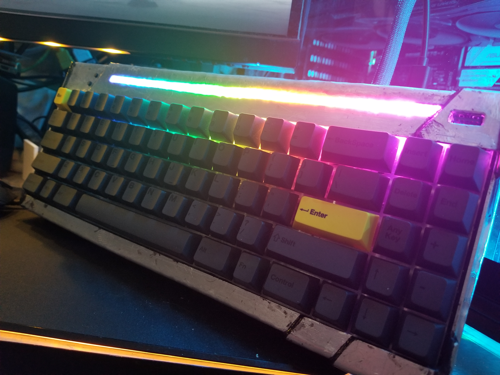

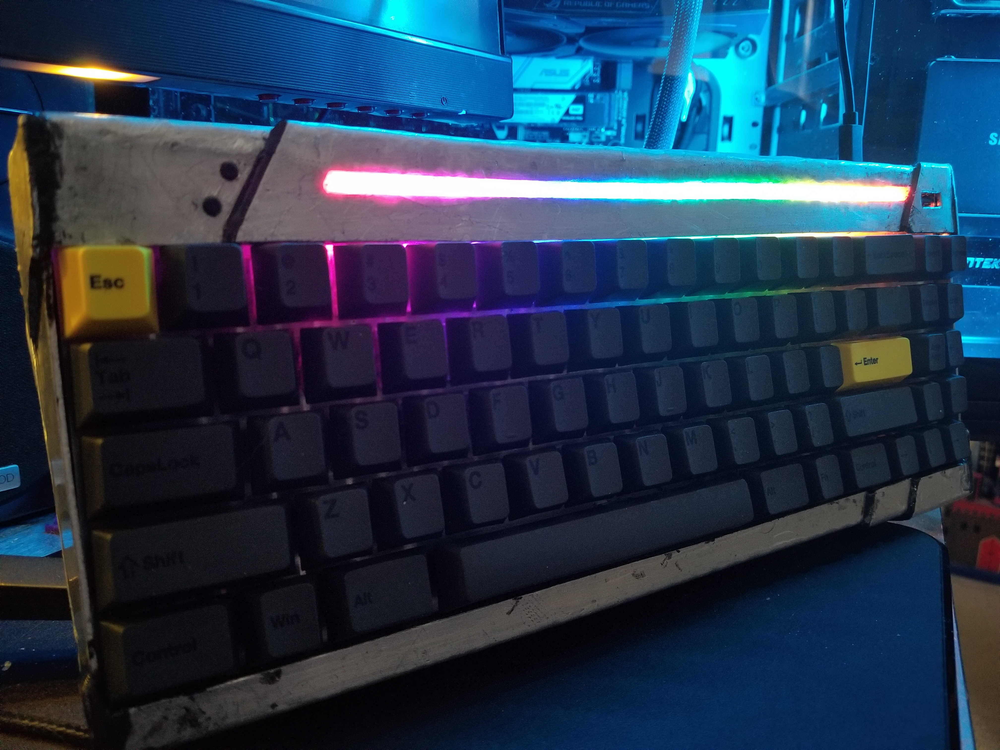

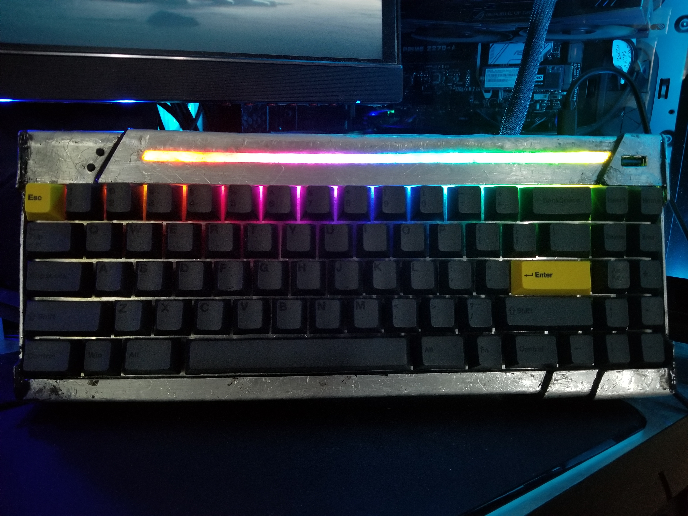

### Attached to the [Wii Sleeper](https://github.com/LegoRocket/Wii-Sleeper)

### Assembling the Clavier
Here you can see the assembly and design process
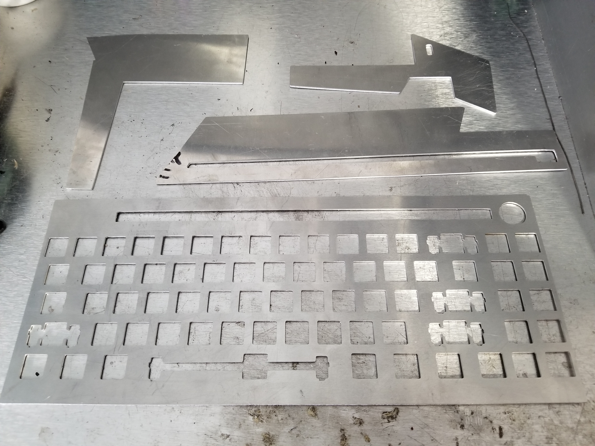
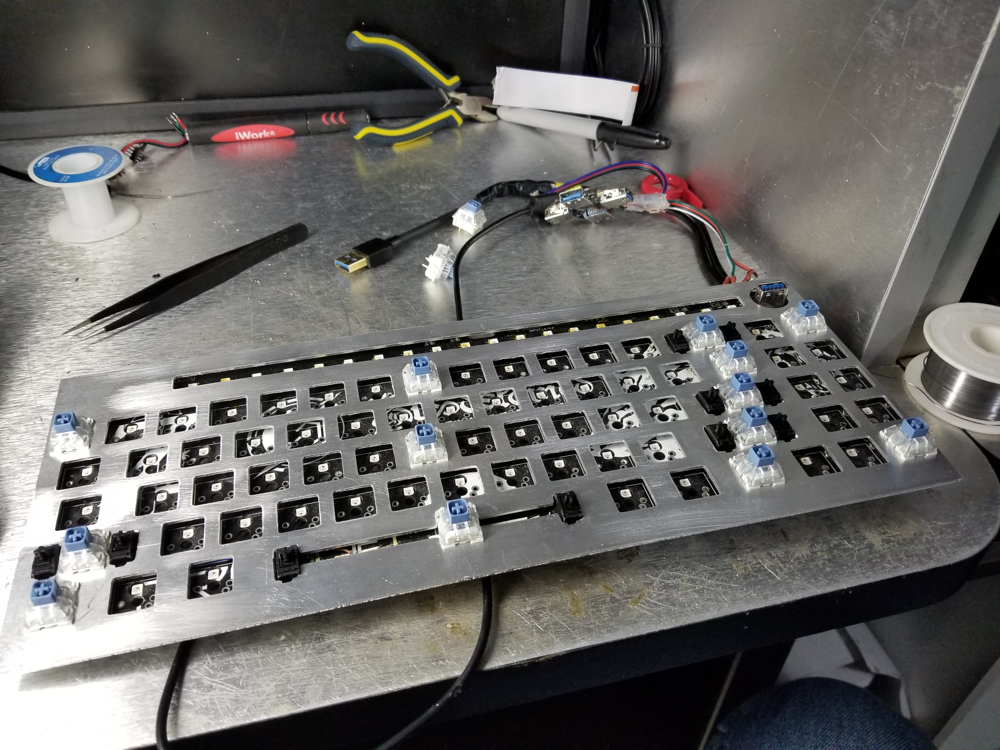
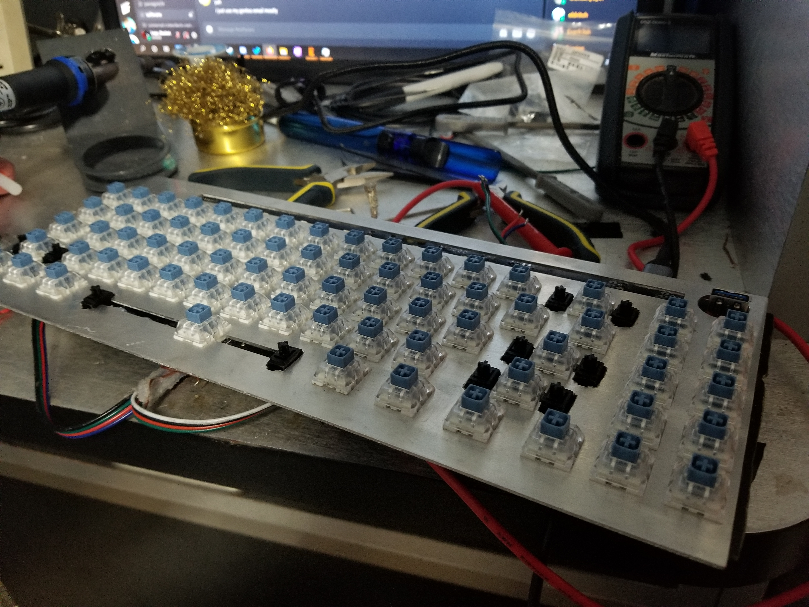
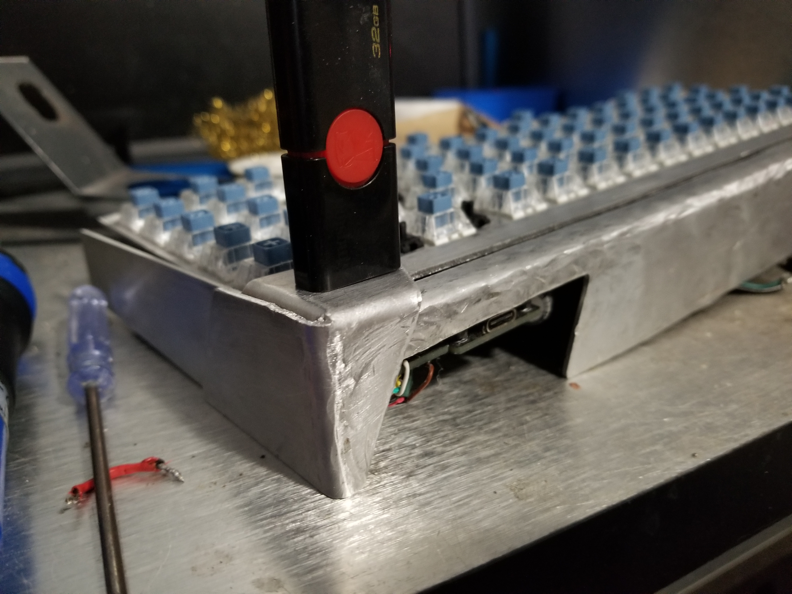
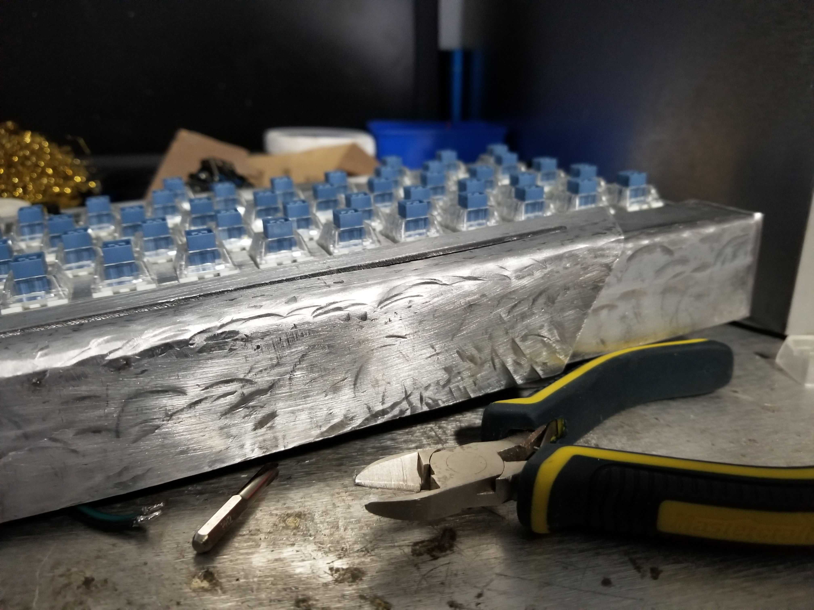

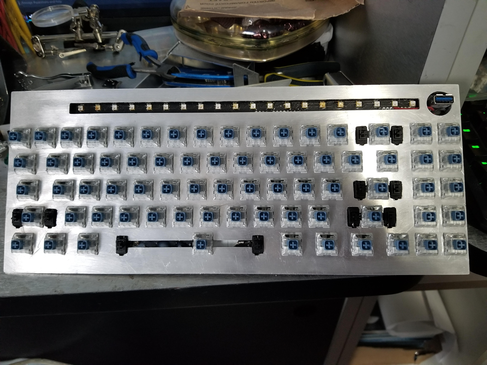

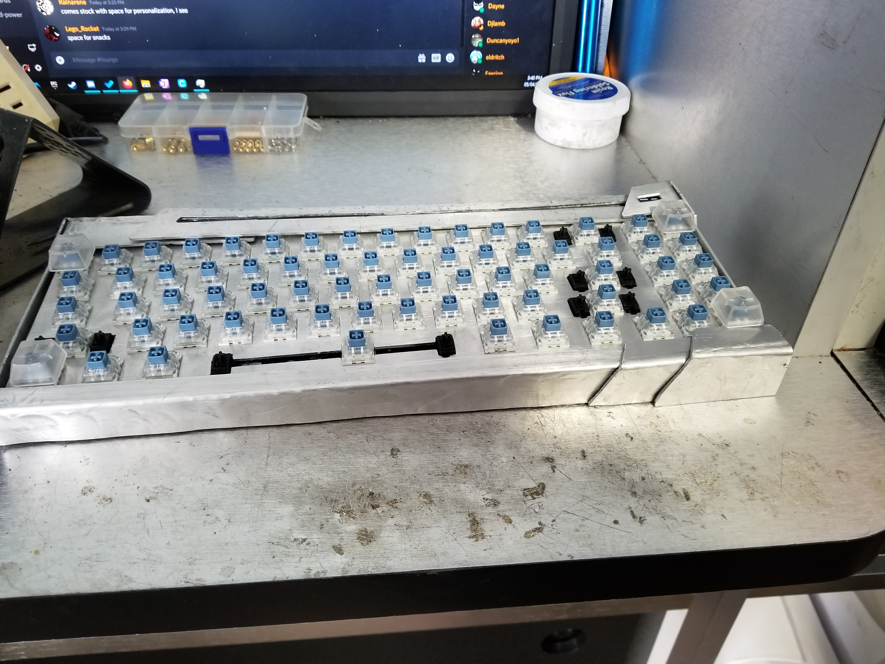
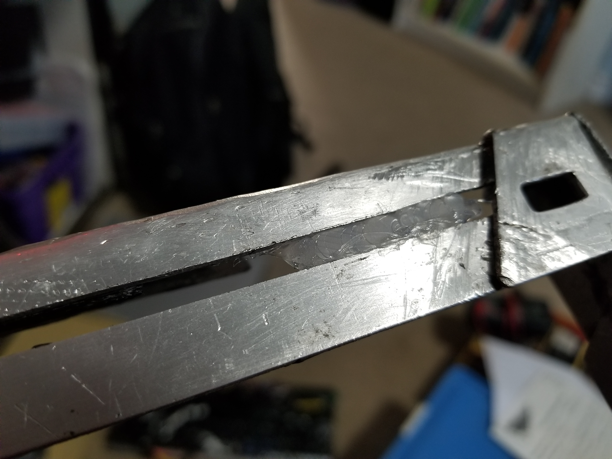
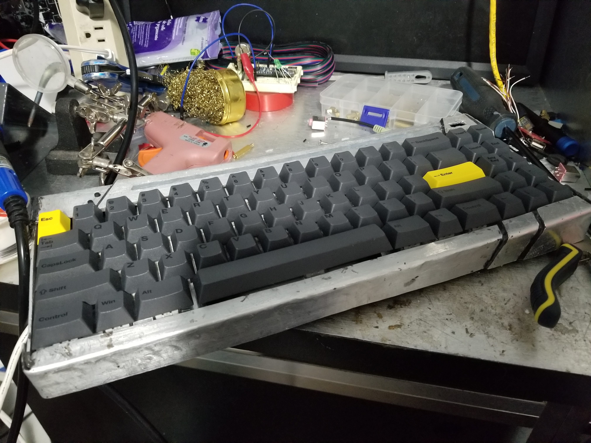

.jpg)
