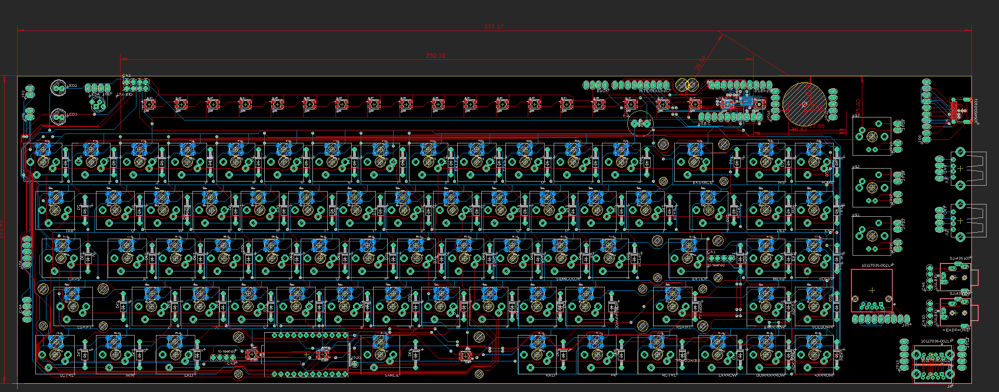

# Clavier-Keyboard                      [![CC BY-NC-SA 4.0][cc-by-nc-sa-shield]][cc-by-nc-sa]
The first custom keyboard PCB I've designed. Inspired by Cyberpunk media and Cyberdecks, it's a rough looking keyboard, but designed to be so. I don't recommended to build, but will be posted as inspiration.

Name was picked through the help of the [Cyberdeck Discord.](https://cyberdeck.cafe/) Clavier meaning... Keyboard... in French...

## Support Me!
### [See the stuff I build and support me here!](https://linktr.ee/Lego_Rocket)

## Features
* Custom PCB Layout
* Aluminum Chassis
* Pro Micro running QMK
* Programmable SK6812 LED row
* USB C
* Audio passthrough
* DB25 port - used for combining other ports into one
* USB 3.0 Hub (USB 2.0 Speeds through USB C)
* PC Power/Reset Control (DB25)

.jpg)

## Hardware
Pretty much your bog standard custom mechanical keyboard, however some unique things were added to allow it to stand on it's own. PCB was designed in Eagle and manufactured by JLCPCB.

The keyboard was designed to be a layout that I wanted. The 60% size appeals to me, however I like my navigation cluster. While I could just get a 75% board, the function row isn't used as much, which left me in an odd place. So I set out to design my own keyboard layout, that worked for me. Many of these prebuilts lack some basic IO as well. USB Hubs and audio passthough are uncommon, but a very useful addition. The DB25 ("Parallel" port) was added as a way to dock the keyboard easily. Originally it was going to be a Cyberdeck, with another module for the computer and monitor. This later on was abandoned in favour of the Wii Sleeper (Which will be posted later). This Port hosts all the IO, so audio, USB 3, and power controls were all routed through the port. This allows those top two push-buttons to control the computer. 

Alumiunum was CNC laser cut from a local business. These files were then bent with a hammer and a vice. Obviously this gave a very rough look to they keyboard, but that was intentional. The hammer marks could've been grinded down, but it gave the keyboard a much better personality. Pieces were held together with JB weld, which I felt also added to that aesthetic. Finally, clearcoat was added to the whole case, so that oxidation wouldn't occur on the aluminum. 

This layout has evolved into my second custom PCB keyboard, The Sanctuary. (This keyboard has not been posted yet, stay tuned 👍).

It is the first PCB and true keyboard I ever designed. It has provided a lot of information about how to handle hardware design better. Since this was my first PCB, there's a lot of errors in it. Corners are sharp, routing is inefficient, and breakaway was designed poorly. It was designed with daughter boards so that the extra IO was possible, as well as stiffening connections like the USB C (since connectors like Micro-USB are notorious for failure). This lead to the daughter boards on the right, that you need to cutout with a dremel.

#### Files will be provided, however this is more of an archive, you need a dremel to cut the PCB to proper size, which you shouldn't do because ***fibreglass dust can get in your lungs***.

PCB Layout:

## [Teardown Video](https://youtu.be/Yc9MBV3eU0o)

## Gallery
Some photos of the Clavier board. View more under the [Photos tab](https://github.com/LegoRocket/Clavier-Keyboard/tree/main/Photos)

## License Information:
[![CC BY-NC-SA 4.0][cc-by-nc-sa-shield]][cc-by-nc-sa]

This work is licensed under a
[Creative Commons Attribution-NonCommercial-ShareAlike 4.0 International License][cc-by-nc-sa].

[![CC BY-NC-SA 4.0][cc-by-nc-sa-image]][cc-by-nc-sa]

[cc-by-nc-sa]: http://creativecommons.org/licenses/by-nc-sa/4.0/
[cc-by-nc-sa-image]: https://licensebuttons.net/l/by-nc-sa/4.0/88x31.png
[cc-by-nc-sa-shield]: https://img.shields.io/badge/License-CC%20BY--NC--SA%204.0-lightgrey.svg
