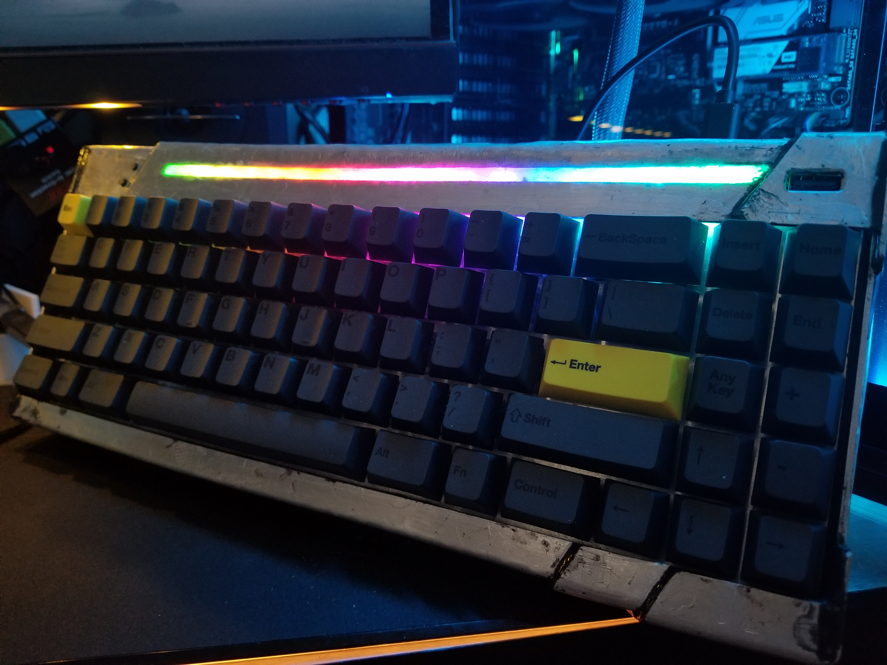
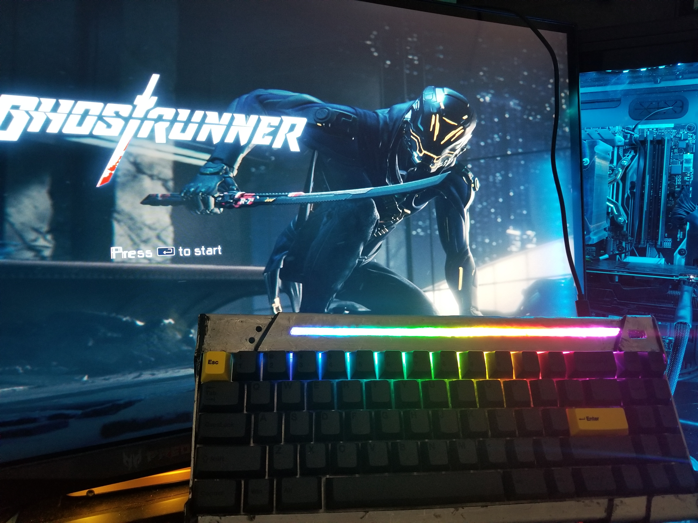
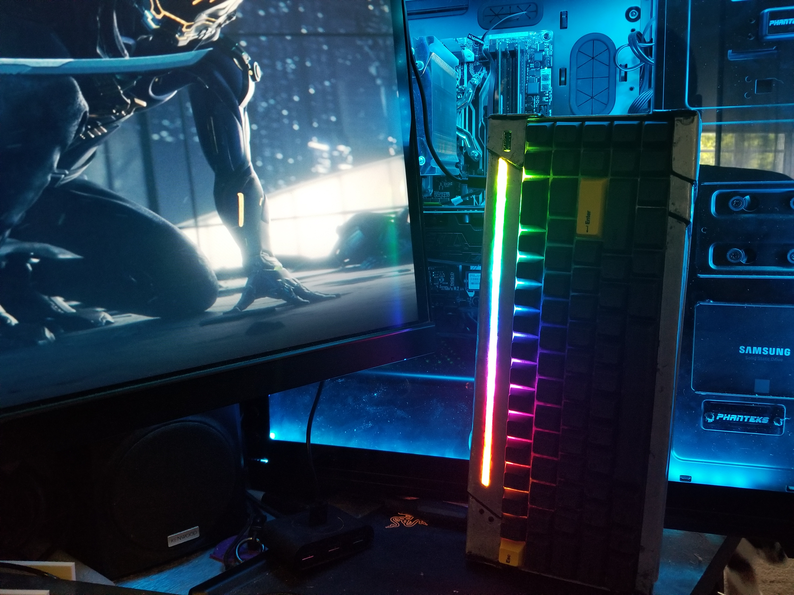
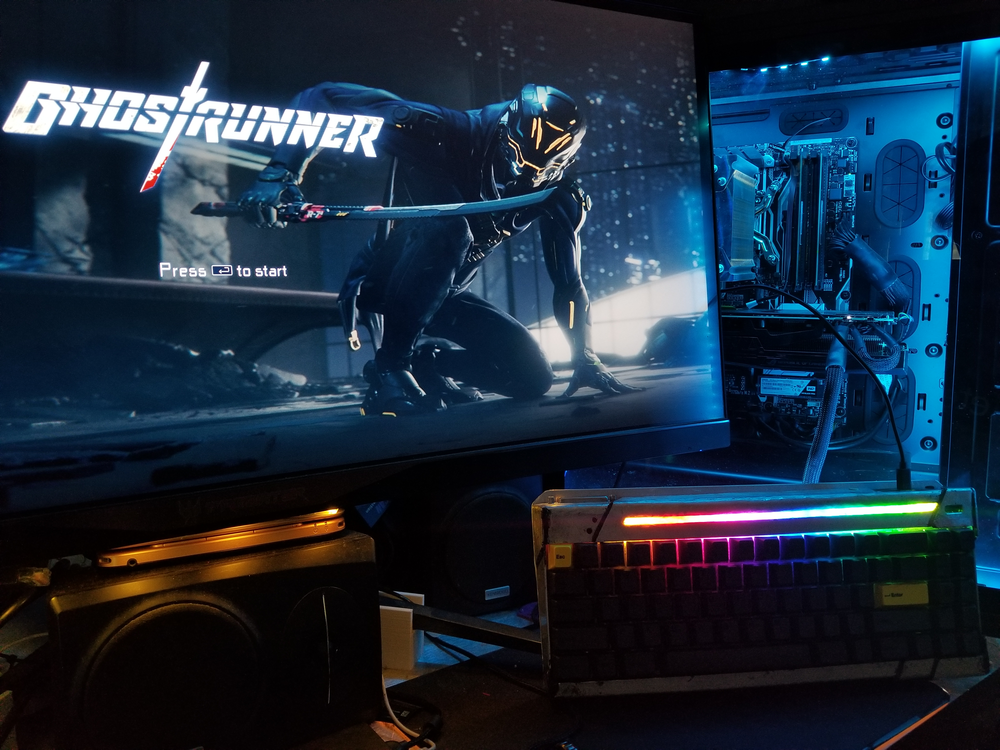
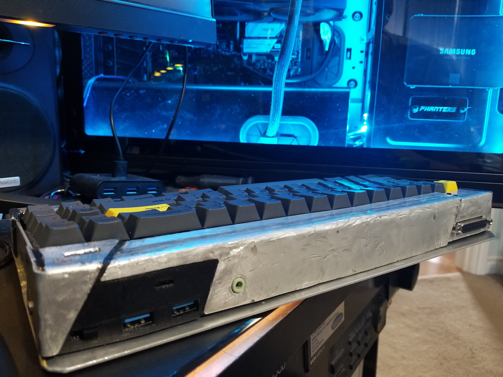

# Clavier-Keyboard
The first custom keyboard PCB I've designed. Inspired by Cyberpunk media and Cyberdecks, it's a rough looking keyboard, but designed to be so. I don't recommended to build, but will be posted as inspiration.

Name was picked through the help of the [Cyberdeck Discord.](https://cyberdeck.cafe/) Clavier meaning... Keyboard... in French...

## Support Me!
[See the stuff I build and support me here!](https://linktr.ee/Lego_Rocket)

## Features
* Custom PCB Layout
* Aluminum Chassis
* Pro Micro running QMK
* Programmable SK6812 LED row
* USB C
* Audio passthrough
* DB25 port - used for combining other ports into one
* USB 3.0 Hub (USB 2.0 Speeds through USB C)

.jpg)
## Hardware
Pretty much your bog standard custom mechanical keyboard, however some unique things were added to allow it to stand on it's own. PCB was designed in Eagle and manufactured by JLCPCB.

The keyboard was designed to be a layout that I wanted. The 60% size appeals to me, however I like my navigation cluster. While I could just get a 75% board, the function row isn't used as much, which left me in an odd place. So I set out to design my own keyboard layout, that worked for me.

This layout has evolved into my second custom PCB keyboard, The Sanctuary. This keyboard has not been posted yet (stay tuned 👍).

Since this was my first PCB, there's a lot of errors in it. Corners are sharp, routing is inefficient, and breakaway was designed poorly. 
#### Files will be provided, however this is more of an Archive, you need a dremel to cut to proper size, which you shouldn't do because ***fibreglass dust can get in your lungs***.

PCB Layout:

## Gallery
Some photos of the Clavier board. View more under the [Photos tab](https://github.com/LegoRocket/Clavier-Keyboard/tree/main/Photos)

